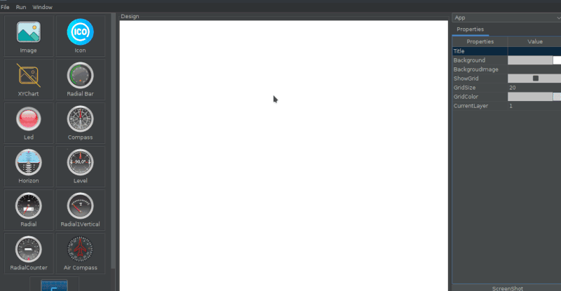

<h1 align="center">
   
  
   
  
  <!--  
  
  
  
  
--> 
  
</h1>

<h4 align="center">RITDevX - Rapid Interface Tool for Devices Experiments</h4>

RITDevX is a visual interface design tool, which allows the creation of interfaces to control and monitor real devices such as **Arduino** and **Raspberry**, allowing to develop experiments quickly.  

You can see it as a serial plotter with steroids.

It consists mainly in this modules:

- **Designer** - Which is the tool to create / design interface, where all aspects are configured.  
- **Controller** - It is the execution tool, which opens the layout defined by the Design module. It is responsible for communicating with devices using the [OpenDevice](https://github.com/OpenDevice/opendevice-lib-arduino) library (but can by extended). 
  This module can be *embedded* into an existing application or can run in *standalone mode*.  
- **Arduino IDE Plugin** - Enable easy integration with the Arduino IDE, and more advanced integration with this [alternative version of the Arduino IDE](https://github.com/ricardojlrufino/Arduino/releases).  ( **TODO ***)

### Designer (preview)

[More prints and Use Cases](https://opendevice.atlassian.net/wiki/spaces/RITDevX/pages/1690435585/Use+Cases)

### Controller (preview)

[More prints and Use Cases](https://opendevice.atlassian.net/wiki/spaces/RITDevX/pages/1690435585/Use+Cases)

## Key features (Designer)

- Drag and drop components  
- Drag and drop external images  
- Keyboard editing  
- Save / Open layout files  
- Allow rapid simulation ( need Controller )  
- Widgets  
  - [x] Images  
  
  - [x] Buttons (image)
  
  - [x] Icons
  
  - [x] Gauges  
  
    - [x] Simple (color based)
    - [x] Multiple gauges with skins
  
  - [x] LineChart
  
  - [x] SparkLine
  
  - [x] Panels
  
  - [x] Label Text
  
  - [x] Radial Bars
  
  - [x] Led
  
  - [x] Display (with Skins)
  
  - [x] LevelsBar 
  
    

Please see: [docs/WORK_IN_PROGRESS.md](docs/WORK_IN_PROGRESS.md), to a full list of planned features and the current state

See:  [User Guide Designer Tutorial](https://opendevice.atlassian.net/wiki/spaces/RITDevX/pages/1581908126/User+Guide)

## Key features (Controller)

- Run layouts in standalone mode
- Log View
- Communication  
  - [x] Usb  
  - [ ] Bluetooth  
  - [ ] TCP / WiFi  
- Arduino Library for easy integration. 

Please see: [docs/WORK_IN_PROGRESS.md](docs/WORK_IN_PROGRESS.md), to a full list of planned features and the current state

See:  [User Guide Controller Tutorial](https://opendevice.atlassian.net/wiki/spaces/RITDevX/pages/1581908143/User+Guide+Controller)

### Call for contributions

The project is in its early stages of development, and help from the community is always welcome.
Here are some points you can contribute:

- Developing new components / widgets
- Website creation (git-hub pages)
- Share of images for widgets, so that we can build an image database
- Please see file: [docs/WORK_IN_PROGRESS.md](docs/WORK_IN_PROGRESS.md)

## Download and Install

The project binaries are available in github releases.

https://github.com/ricardojlrufino/RITDevX/releases

### Requirements

- Java 8  
- SO: Windows / Linux / MacOs  

### Build from Sources

 - `mvn package -Dmaven.test.skip=true`
 -  This is a multi-module `maven` project, you can import (root pom.xml) your favorite IDE

## Docs

See documentation and examples at:

[RITDevX Wiki](https://opendevice.atlassian.net/wiki/spaces/RITDevX)

## Support/Sponsor

Helps open source software continue to evolve. Support my work on Patreon  

